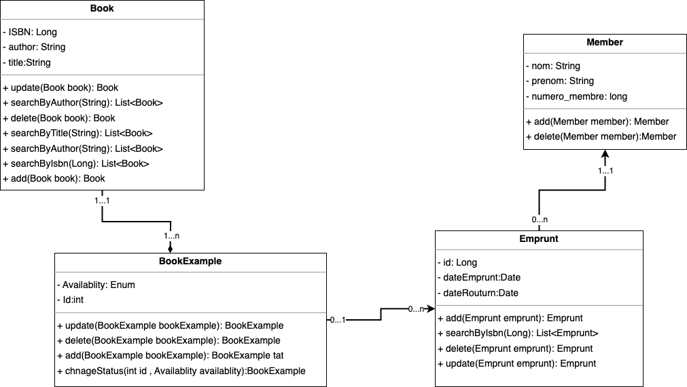

# Application Gestion Bibliotheque

### Installation de l'application

- Cloner le projet sur votre machine locale
- Ouvrir le projet dans votre IDE
- run commande `mvn clean install` pour installer les dépendances
- run commande docker `docker-compose up` pour lancer la base de données
- exécuter le script `./database.sql` pour créer la base de données
- run commande `mvn spring-boot:run` pour lancer l'application
- L'application est accessible sur console

### Prérequis
- Java 17 and +
- Maven 3.6.3
- DOCKER
- git 2.25.1
- IDE (IntelliJ IDEA, Eclipse, NetBeans, etc.)

## DIAGRAMME DE CLASSES

## Contexte
La bibliothèque de l’université virtuelle rencontre des défis liés à une gestion manuelle des livres, entraînant :
- Gestion inefficace : Tâches manuelles chronophages, erreurs fréquentes et suivi difficile de l’état des livres.
- Recherche laborieuse : Absence d’un système de recherche efficace, rendant l’accès aux livres complexe pour les étudiants et le personnel.
- Manque de statistiques : Pas de suivi clair des livres disponibles, empruntés ou perdus, limitant l’optimisation des collections.

## Fonctionnalités
- Gestion des livres : Ajout, mise à jour et suppression des livres via leur titre, auteur et ISBN.
- Recherche efficace : Recherche de livres par titre ou auteur.
- Gestion des emprunts/retours : Suivi des emprunts et retours avec mise à jour automatique de l’état des livres.
- Rapports statistiques : Génération de rapports sur les livres disponibles, empruntés et perdus.

 ## Histoires Utilisateurs
1. Ajouter un livre: Saisir titre, auteur et ISBN pour ajouter un livre (statut initial : disponible).
2. Lister les livres disponibles : Afficher la liste des livres avec titre, auteur et statut.
3. Rechercher un livre : Rechercher par titre ou auteur et afficher les résultats correspondants.
4. Emprunter un livre : Saisir l’ISBN pour enregistrer un emprunt, mettre à jour le statut en « emprunté » et enregistrer les informations de l’emprunteur (nom, numéro d’étudiant, etc.).
5. Retourner un livre : Saisir l’ISBN pour marquer un livre comme « disponible » et supprimer les informations d’emprunt.
6. Lister les livres empruntés : Afficher les livres empruntés avec leurs informations (titre, auteur, emprunteur, date d’emprunt).
7. Supprimer un livre : Supprimer un livre via son ISBN.
8. Modifier un livre : Mettre à jour les informations (titre, auteur) d’un livre via son ISBN.
9. Générer un rapport : Produire un rapport statistique sur les livres disponibles, empruntés et perdus.

